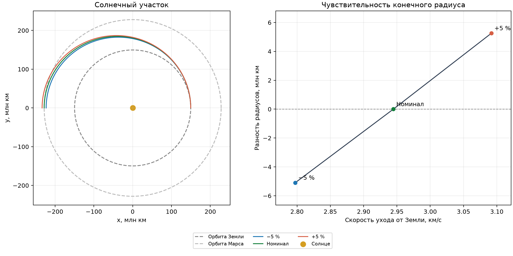
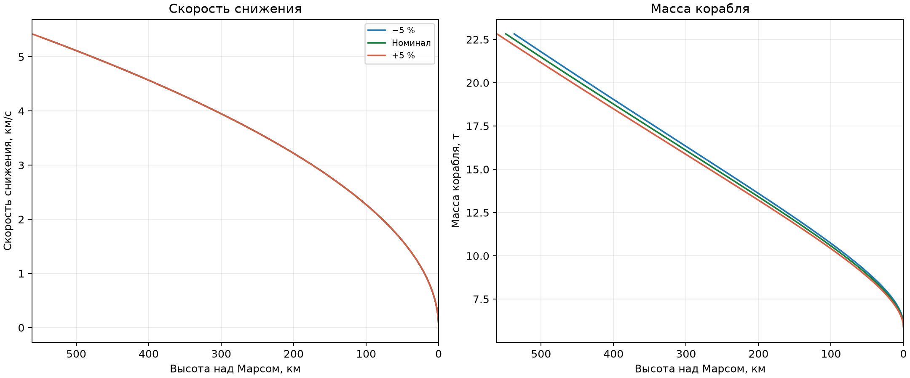

# Краткий отчёт: полёт на Марс

## Задача и метод

Численно рассчитаны три участка полёта материальной точки: вертикальный
взлёт с Земли до заданной энергии ухода, пассивное движение в поле Солнца и
радиальное торможение у Марса до практически нулевой скорости контакта.
В качестве аналитического ориентира используется переход Гомана. Все
расчёты ведутся в СИ; в таблицах значения переведены в удобные единицы.

На активных участках интегрируются радиус, знаковая радиальная скорость и
масса. Ускорение от тяги ограничено перегрузкой 3 $g_0$; ощущаемая
перегрузка равна $F/(mg_0)$ и не включает гравитационное ускорение.
Солнечный участок интегрирует две координаты и две компоненты скорости в
центральном поле Солнца. Формулы, начальные условия и пределы применимости
приведены в документах по [взлёту](../docs/earth_ascent.md),
[перелёту](../docs/solar_transfer.md) и [посадке](../docs/mars_landing.md).

Стандартные исходные данные: радиус орбиты Земли 1 а.е., радиус орбиты
Марса 1,523679 а.е., начальная масса 500 т, сухая масса 5 т,
эффективная скорость истечения 4,5 км/с. Перечень значений и единиц
содержится в [конфигурации](../mars_flight/config.py).

## Изменение скорости ухода от Земли

Целевая скорость ухода меняется на $\pm5\%$ относительно значения перехода
Гомана. Для каждого случая заново рассчитываются взлёт и солнечный
участок; в солнечную модель передаётся скорость, восстановленная из
**фактической** энергии после выключения земного двигателя.

| Множитель скорости ухода | Взлёт, с | Масса после взлёта, т | Солнечный участок, сут. | Разность с радиусом орбиты Марса, млн км |
|---:|---:|---:|---:|---:|
| 0,95 | 474,105 | 23,040 | 253,644 | −5,094 |
| 1,00 | 475,538 | 22,825 | 258,866 | ≈0 |
| 1,05 | 477,039 | 22,602 | 264,294 | +5,259 |

Разность радиусов вычисляется в точке, противоположной начальной точке
солнечной орбиты. Знак «−» означает меньший радиус корабля; знак «+» —
больший. Для номинального случая значение около 0,00058 м обусловлено
численным интегрированием идеализированного перехода Гомана. При отклонении
скорости на $\pm5\%$ радиальная ошибка достигает миллионов километров;
такие два случая **не передаются** модели посадки.



## Сравнение с аналитическими решениями

Для перехода Гомана аналитические формулы дают 258,865759 суток до
противоположной точки, радиус 227,939134 млн км и скорость
21,480496 км/с. Численное решение с теми же начальными условиями
отличается по времени менее чем на $10^{-4}$ с, по радиусу менее чем на
1 мм, по скорости менее чем на $10^{-6}$ м/с. Относительное изменение
удельной энергии и момента импульса на солнечном участке меньше
$6\cdot10^{-15}$ и $4\cdot10^{-15}$ соответственно.

Второй аналитический случай — нулевая скорость ухода относительно Земли.
Тогда солнечная орбита круговая, её радиус равен 1 а.е., а время до
противоположной точки равно половине периода:

```math
t_{1/2}=\pi\sqrt{\frac{r_E^3}{\mu_S}}=182{,}628449\ \text{суток}.
```

Численный радиус в этой точке отличается от $r_E$ менее чем на 1 мм.

На марсианском участке при постоянном ускорении от тяги $A$ аналитический
закон расхода топлива имеет вид

```math
m(t)=m_0\exp\left(-\frac{A(t-t_{\mathrm{ign}})}{u_e}\right).
```

Для номинального торможения он даёт 5,938285 т; численный результат
совпадает в пределах $10^{-6}$ кг. На участке свободного падения масса и
удельная механическая энергия сохраняются.

## Изменение скорости подлёта к Марсу

Следующий опыт относится **только к модели посадки**. Начальная масса
во всех трёх расчётах одинаковая — 22,825 т после номинального взлёта;
модуль скорости относительно Марса меняется на $\pm5\%$ вокруг
2,648895 км/с. Эти два изменённых значения не являются результатом
предыдущих солнечных траекторий из первой таблицы.

| Множитель скорости подлёта | Высота включения двигателя, км | Торможение, с | Масса при контакте, т | Максимальная перегрузка |
|---:|---:|---:|---:|---:|
| 0,95 | 537,114 | 203,769 | 6,024 | 3 $g_0$ |
| 1,00 | 548,741 | 205,948 | 5,938 | 3 $g_0$ |
| 1,05 | 560,964 | 208,215 | 5,851 | 3 $g_0$ |

Скорость контакта во всех трёх случаях меньше $10^{-6}$ м/с, высота
остановки отличается от принятой поверхности менее чем на 1 м. Более
быстрый подлёт требует более раннего включения двигателя и расходует
больше топлива. При прежней сухой массе 20 т топлива не хватало:
двигатель прекращал работу примерно в 446 км над Марсом.



## Воспроизведение рисунков

Из корня проекта после установки зависимостей:

```bash
MPLBACKEND=Agg python -m report.generate_figures
```

Скрипт использует текущие стандартные значения из `mars_flight/config.py`,
повторяет расчёты для множителей 0,95, 1,00 и 1,05 и сохраняет оба PNG в
`report/figures/`. После изменения конфигурации рисунки и численные значения
в таблицах требуется пересчитать вместе.

## Границы результата

Положение Марса, дата старта и наведение на него не рассчитываются. На
стыке солнечного и марсианского участков предполагаются совпадение с
планетой и радиальная траектория к её центру. Атмосфера, вращение планет,
ступени ракеты и взаимодействие гравитационных полей не моделируются.
Численная точность внутри этой схемы не равна точности реальной посадки;
время солнечного перелёта и время снижения также нельзя складывать в
точное время миссии.

Стандартный результат выводится командой `python -m mars_flight`.
Команда `python -m unittest discover -s tests -v` проверяет аналитические
частные случаи, ограничения и физические тенденции при изменении
параметров.
