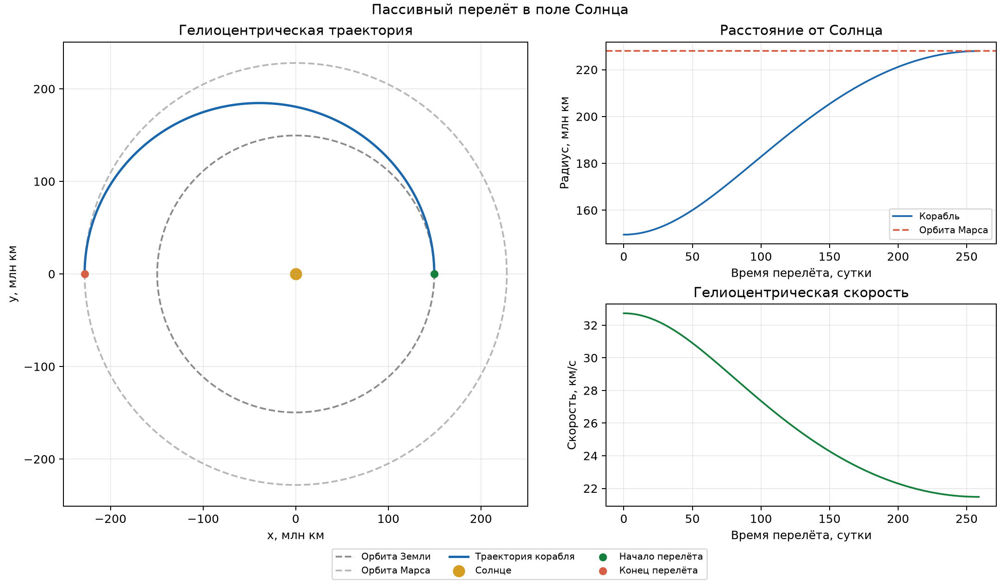

# Краткий отчёт: полёт на Марс

## Модель

Рассчитаны три участка: вертикальный взлёт с Земли, перелёт с выключенным
двигателем в поле Солнца и радиальное торможение у Марса. Корабль считается
материальной точкой; атмосфера и вращение планет не учитываются. Орбиты
планет приняты круговыми и компланарными. Параметры модели заданы в
[`mars_flight/config.py`](../mars_flight/config.py); расчёты ведутся в СИ.

Для взлёта интегрируются расстояние $r$ от центра Земли, радиальная скорость
$v$ и масса $m$:

```math
\dot r=v,\qquad \dot v=\frac{F}{m}-\frac{\mu_E}{r^2},\qquad
\dot m=-\frac{F}{u_e},\qquad
F=\min(F_{\max},3mg_0).
```

Двигатель выключается, когда удельная энергия
$\varepsilon_E=v^2/2-\mu_E/r$ достигает $v_{\infty,E}^2/2$.
Здесь $v_{\infty,E}$ — требуемая скорость ухода относительно Земли.
Её аналитическое значение для перехода Гомана задаёт начальную цель;
фактическая скорость после взлёта вычисляется как $\sqrt{2\varepsilon_E}$.

На солнечном участке решается
$\ddot{\mathbf r}=-\mu_S\mathbf r/|\mathbf r|^3$ при начальной
гелиоцентрической скорости, равной сумме
орбитальной скорости Земли и скорости ухода. Участок завершается на
противоположной стороне орбиты. При совпадении с Марсом скорость
относительно него равна
$\sqrt{v_r^2+(v_t-\sqrt{\mu_S/r_M})^2}$.
При посадке сначала интегрируется свободное падение, затем торможение
с постоянным ускорением от тяги $A=\min(F_{\max}/m_0,3g_0)$:
$\dot v=A-\mu_M/r^2$, $\dot m=-mA/u_e$.
Ощущаемая перегрузка $F/(mg_0)$ не превышает 3; гравитация в неё не
включается.

## Расчёты при разных начальных скоростях

Стандартные значения: орбита Земли 1 а.е., орбита Марса 1,523679 а.е.,
начальная масса 500 т, сухая масса 5 т, эффективная скорость истечения
4,5 км/с. Скорость ухода от Земли изменялась на $\pm5\%$ относительно
значения перехода Гомана. Каждый раз заново рассчитывались взлёт и
солнечный участок.

| Скорость ухода | Взлёт, с | Масса после взлёта, т | Перелёт, сут. | Отклонение от орбиты Марса, млн км |
|---:|---:|---:|---:|---:|
| −5 % | 474,105 | 23,040 | 253,644 | −5,094 |
| Номинал | 475,538 | 22,825 | 258,866 | ≈0 |
| +5 % | 477,039 | 22,602 | 264,294 | +5,259 |

Отклонение радиуса измерено на противоположной стороне солнечной орбиты.
Положительное значение означает перелёт дальше орбиты Марса. Варианты
$\pm5\%$ не удовлетворяют условию стыковки по радиусу и потому не
передаются модели посадки.

Отдельно изменялась **только** начальная скорость снижения относительно
Марса: $\pm5\%$ от 2,648895 км/с. Масса во всех трёх опытах оставалась
номинальной — 22,825 т после взлёта.

| Скорость подлёта | Включение двигателя, км | Торможение, с | Масса при контакте, т |
|---:|---:|---:|---:|
| −5 % | 537,114 | 203,769 | 6,024 |
| Номинал | 548,741 | 205,948 | 5,938 |
| +5 % | 560,964 | 208,215 | 5,851 |

Во всех трёх случаях скорость контакта меньше $10^{-6}$ м/с,
перегрузка не выше 3. Более быстрый подлёт требует более раннего
включения двигателя и оставляет меньше топлива.



Рисунок показывает номинальный солнечный участок: траекторию между
круговыми орбитами, рост расстояния от Солнца и уменьшение
гелиоцентрической скорости. Программа создаёт такой график при каждом
запуске в файле `results/<папка запуска>/transfer.png`.

## Сравнение с аналитическими решениями

1. **Переход Гомана.** Формула
   $t_H=\pi\sqrt{[(r_E+r_M)/2]^3/\mu_S}$ даёт 258,865759 суток;
   численное время отличается менее чем на $10^{-4}$ с. Радиус
   227,939134 млн км отличается менее чем на 1 мм, скорость
   21,480496 км/с — менее чем на $10^{-6}$ м/с.
2. **Круговая солнечная орбита.** При нулевой скорости ухода относительно
   Земли теория даёт время до противоположной точки
   $\pi\sqrt{r_E^3/\mu_S}=182,628449$ суток и радиус 1 а.е.
   Численный радиус отличается менее чем на 1 мм.
3. **Расход топлива при посадке.** При постоянном $A$ теория даёт
   $m(t)=m_0\exp[-A(t-t_{\mathrm{ign}})/u_e]$.
   Для номинальной посадки это 5,938285 т; отличие от численного решения
   меньше $10^{-6}$ кг.

## Пределы применимости

Начальная дата и положение Марса не рассчитываются. Совпадение корабля с
Марсом в конце солнечного участка и дальнейшее радиальное снижение заданы
допущениями; проверка совпадения радиусов сама по себе не доказывает
встречу с планетой. Атмосфера, вращение планет, ступени ракеты и
одновременное действие гравитационных полей не моделируются. Поэтому
малые численные ошибки не означают такую же точность реального полёта.
